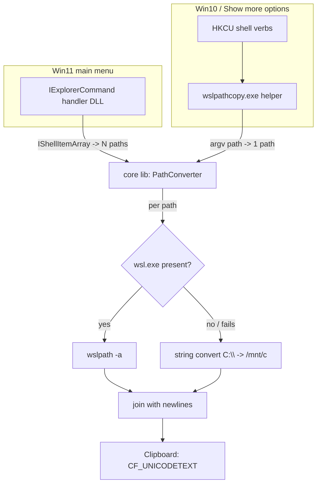
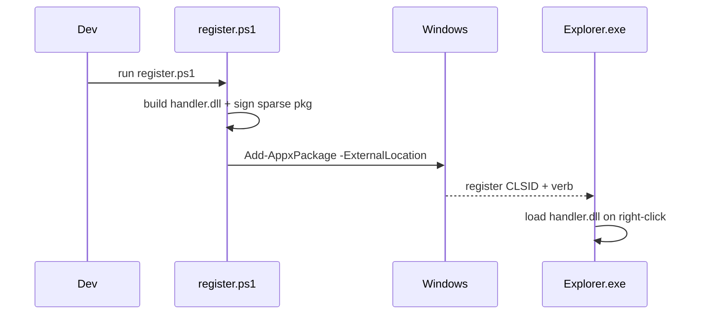

# feat: Copy as WSL Path — Explorer Context-Menu Entry

## Summary

Build a Windows desktop utility that adds a **"Copy as WSL path"** entry to the
Explorer right-click menu for files, folders, folder backgrounds, and drives.
Selecting it converts each selected Windows path to its WSL form via
`wsl wslpath -a` and places the newline-joined result on the clipboard.

Ships with **two registration mechanisms**: a modern `IExplorerCommand` COM
handler in a **sparse MSIX package** (Win11 main context menu) and **classic
`HKCU` shell verbs** invoking a small CLI helper (Win10 / Win11 "Show more
options"). All written in **C++ (WRL)** around a single shared core library.

Origin: `docs/brainstorms/2026-06-14-wsl-path-context-menu-requirements.md`.

---

## Problem Frame

Developers move constantly between Windows Explorer and a WSL shell and need a
file/folder's path in WSL form (`/mnt/c/...`) to paste into a terminal, script,
or config. Today this is manual translation of drive letter + slashes — error
prone, and wrong for UNC/network paths or custom automount roots. A one-click
context-menu action removes that friction.

---

## Key Technical Decisions

- **KTD1 — Language: C++ with WRL** (see origin open question 1). Canonical path
  for shell extensions: Microsoft PowerToys and all official sparse-package /
  `IExplorerCommand` samples use it; no managed runtime is loaded into
  `Explorer.exe`; lightest in-process footprint. NativeAOT-C# and Rust were
  considered (see Alternatives).
- **KTD2 — Conversion via `wslpath` with string fallback** (resolves origin open
  question 2). Primary: shell out to `wsl.exe wslpath -a '<path>'` (correct for
  UNC, mapped drives, custom `/etc/wsl.conf` mount roots — per origin R3). When
  `wsl.exe` is absent or the call fails, fall back to **in-process string
  conversion** (`C:\Users\x` → `/mnt/c/Users/x`) so the entry always works.
  This extends the brainstorm's wslpath-only choice; recorded as an accepted
  deviation.
- **KTD3 — Shared core library.** Conversion + clipboard logic lives in one
  static lib (`core`) consumed by both the COM handler and the CLI helper. Single
  source of truth; the two front-ends differ only in how they obtain the
  selected paths.
- **KTD4 — Path acquisition differs by front-end.** Modern handler receives an
  `IShellItemArray` natively → full multi-select aggregation (origin R4).
  Classic shell verbs invoke the helper **once per selected item** (Windows
  limitation), so Win10 multi-select copies per-item rather than newline-joined.
  Known limitation, documented; the modern handler is the primary surface.
- **KTD5 — Sparse MSIX for modern registration.** A sparse package (manifest +
  external-location declaration) registers the `IExplorerCommand` handler without
  repackaging the unpackaged exe/dll. Requires a signed package even for local
  install → dev uses a self-signed cert added to Trusted People (production
  signing deferred).

---

## Output Structure

```
right-click-wsl-path/
├── src/
│   ├── core/                  # shared static lib (no UI, no COM)
│   │   ├── PathConverter.h/.cpp     # wslpath + string-fallback conversion
│   │   ├── WslProcess.h/.cpp        # launch wsl.exe, capture stdout
│   │   └── Clipboard.h/.cpp         # set clipboard text (CF_UNICODETEXT)
│   ├── handler/               # modern Win11 IExplorerCommand COM DLL
│   │   ├── dllmain.cpp              # DllGetClassObject / class factory
│   │   ├── ExplorerCommand.h/.cpp   # IExplorerCommand impl
│   │   └── handler.def
│   └── cli/                   # classic Win10 helper exe
│       └── main.cpp                 # arg -> core -> clipboard
├── packaging/
│   ├── AppxManifest.xml       # sparse package manifest (com + desktop ext)
│   ├── register.ps1           # build sparse pkg, sign, Add-AppxPackage
│   ├── unregister.ps1
│   └── classic-install.reg    # HKCU shell verbs for the CLI helper
├── test/
│   └── core_tests.cpp         # unit tests for PathConverter
├── docs/
├── CMakeLists.txt             # or .sln — see U1
└── README.md
```

Tree is a scope declaration; per-unit **Files** are authoritative.

---

## High-Level Technical Design

Two front-ends, one core. Selection acquisition is the only branch.



Sparse-package registration flow (Win11):



---

## Implementation Units

### U1. Project scaffold + build system

**Goal:** Buildable skeleton producing the three artifacts (core lib, handler
DLL, CLI exe).
**Requirements:** Enables all (R1–R6).
**Dependencies:** none.
**Files:** `CMakeLists.txt` (or `RightClickWslPath.sln` + per-project vcxproj),
`src/core/`, `src/handler/`, `src/cli/` stubs, `README.md`, `.gitignore`.
**Approach:** Choose CMake (VS generator) for portability; targets: `core`
(static lib), `handler` (DLL, exports `DllGetClassObject`/`DllCanUnloadNow`),
`cli` (console exe). Link handler + cli against core. Target Windows 10 SDK
(10.0.19041+) for `IExplorerCommand` and sparse-package APIs.
**Patterns to follow:** Microsoft PowerToys shell-extension module layout;
`Windows-classic-samples` `IExplorerCommand` sample.
**Test scenarios:** `Test expectation: none -- scaffolding only.` Verification is
a clean build of all three targets.
**Verification:** All targets compile and link; handler DLL exports resolve via
`dumpbin /exports`.

### U2. Core: Windows→WSL path conversion

**Goal:** Convert a single Windows path to WSL form, with wslpath primary and
string fallback.
**Requirements:** R3 (conversion), KTD2.
**Dependencies:** U1.
**Files:** `src/core/PathConverter.h`, `src/core/PathConverter.cpp`,
`src/core/WslProcess.h`, `src/core/WslProcess.cpp`, `test/core_tests.cpp`.
**Approach:** `PathConverter::ToWslPath(wstring win) -> wstring`. First call
`WslProcess::RunWslPath(win)` which launches `wsl.exe wslpath -a <path>` via
`CreateProcess` with redirected stdout (no visible window:
`CREATE_NO_WINDOW`), captures + trims the line. On non-zero exit, launch
failure, or empty output, fall back to `StringConvert(win)`:
lowercase drive letter → `/mnt/<letter>`, backslashes → forward slashes,
strip the `:`. UNC paths (`\\server\share`) with no WSL: leave a best-effort
`//server/share` or return original + flag (decide at impl; string fallback for
UNC is inherently lossy — wslpath is the correct path for those).
**Patterns to follow:** redirected-pipe `CreateProcess` pattern (MSDN "Creating
a Child Process with Redirected Input and Output").
**Test scenarios:**
- Covers AE-equivalent of R3. `C:\Users\foo\bar` (string fallback path) → `/mnt/c/Users/foo/bar`.
- Lowercasing: `D:\Temp` → `/mnt/d/Temp`.
- Trailing backslash: `C:\Users\foo\` → `/mnt/c/Users/foo` (no trailing slash, or documented as preserved — assert chosen behavior).
- Path with spaces: `C:\Program Files\x` → `/mnt/c/Program Files/x`.
- Drive root: `C:\` → `/mnt/c/` (assert chosen trailing behavior).
- wslpath success path: stub/inject `WslProcess` to return `/custom/mount/foo` → returned verbatim (proves wslpath output wins over string convert).
- wslpath failure → fallback: injected failure → string-convert result returned.
- Empty/invalid input → defined behavior (empty out, no crash).

*Note:* `WslProcess` should be injectable (interface or function pointer) so
conversion logic is unit-testable without a real WSL install.

### U3. Core: clipboard writer

**Goal:** Place UTF-16 text on the Windows clipboard reliably.
**Requirements:** R5.
**Dependencies:** U1.
**Files:** `src/core/Clipboard.h`, `src/core/Clipboard.cpp`,
`test/core_tests.cpp` (additions).
**Approach:** `Clipboard::SetText(wstring)` → `OpenClipboard`,
`EmptyClipboard`, `GlobalAlloc(GMEM_MOVEABLE)` for `CF_UNICODETEXT`, copy
including null terminator, `SetClipboardData`, `CloseClipboard`. Handle
open-failure (another process holds clipboard) with a short bounded retry.
**Patterns to follow:** standard Win32 `CF_UNICODETEXT` clipboard idiom.
**Test scenarios:**
- Round-trip: set text, read back via `GetClipboardData` → equal (integration test, needs a window-station; gate behind a runnable-locally tag).
- Empty string → clears/sets empty without crash.
- Retry path: simulate `OpenClipboard` failure once → succeeds on retry.
**Verification:** Manual — copy via the app, paste into Notepad shows expected text.

### U4. Core: multi-path aggregation

**Goal:** Convert N paths and join newline-separated (selection order).
**Requirements:** R4.
**Dependencies:** U2, U3.
**Files:** `src/core/PathConverter.cpp/.h` (add
`ToWslPathsJoined(vector<wstring>) -> wstring`), `test/core_tests.cpp`.
**Approach:** Map each input through `ToWslPath`, join with `\n` (LF, not CRLF —
target is a WSL shell). Preserve input order. One wslpath process per path is
acceptable for v1; note batching as a future optimization.
**Test scenarios:**
- Two paths → two lines, order preserved.
- Single path → no trailing newline.
- One path fails wslpath, other succeeds → both present (fallback applied to the failing one).
- Empty list → empty string.

### U5. Modern handler: IExplorerCommand COM DLL

**Goal:** In-process COM handler exposing the verb to the Win11 main menu over a
selection.
**Requirements:** R1 (all targets), R2 (label), R4, R6 (modern), KTD1, KTD4.
**Dependencies:** U4.
**Files:** `src/handler/dllmain.cpp`, `src/handler/ExplorerCommand.h`,
`src/handler/ExplorerCommand.cpp`, `src/handler/handler.def`.
**Approach:** Implement `IExplorerCommand` via WRL `RuntimeClass`. `GetTitle` →
"Copy as WSL path" (R2). `GetState` → enabled for all selection types (R1).
`GetIcon`/`GetFlags` as needed. `Invoke(IShellItemArray*)` → enumerate items,
`GetDisplayName(SIGDN_FILESYSPATH)` per item → `vector<wstring>` →
`core::ToWslPathsJoined` → `core::Clipboard::SetText`. Standard class factory +
`DllGetClassObject`, `DllCanUnloadNow`, ref counting in `dllmain.cpp`. Stable
CLSID generated and recorded in code + manifest.
**Approach note — folder background & drives:** background invocation provides
the open folder via the command's site/folder; drives arrive as shell items with
`SIGDN_FILESYSPATH` like `C:\`. Confirm each target type resolves a filesystem
path during impl.
**Patterns to follow:** `Windows-classic-samples`
`Win7Samples/winui/shell/appshellintegration/ExplorerCommandVerb`, PowerToys
`IExplorerCommand` modules (WRL style).
**Execution note:** Build incrementally — get the verb appearing with a hardcoded
clipboard string first, then wire in `core`.
**Test scenarios:**
- Unit: `GetTitle` returns the exact label string.
- Unit: `GetState` returns enabled for a non-empty selection.
- Unit (injected core): `Invoke` with a 2-item `IShellItemArray` fake → core receives 2 paths in order. (Mock `IShellItemArray`/`IShellItem`.)
- Manual integration: right-click file/folder/drive/background on Win11 → entry appears in main menu → click → correct clipboard contents.
**Verification:** After U7 registration, entry shows in Win11 main context menu
on all four target types and copies correct paths.

### U6. Classic helper: CLI exe

**Goal:** Console helper that converts argv paths and copies — target of classic
shell verbs.
**Requirements:** R1, R3, R5, R6 (classic), KTD3, KTD4.
**Dependencies:** U4.
**Files:** `src/cli/main.cpp`.
**Approach:** `wslpathcopy.exe "<path>" ["<path>" ...]`. Parse argv (support
`CommandLineToArgvW`), pass to `core::ToWslPathsJoined`, then
`core::Clipboard::SetText`. Compiled as a windowed/`/SUBSYSTEM:WINDOWS`-ish
silent exe (no console flash) or console with `CREATE_NO_WINDOW` invocation from
the verb. Exit codes: 0 ok, non-zero on no args.
**Patterns to follow:** none specific; thin shim over core.
**Test scenarios:**
- Single arg → clipboard has converted path (manual / integration).
- Multiple args → newline-joined (note KTD4: registry typically passes one at a time).
- No args → non-zero exit, no crash.
**Verification:** Run `wslpathcopy.exe "C:\Windows"` → clipboard = `/mnt/c/Windows`.

### U7. Modern registration: sparse MSIX package

**Goal:** Register the handler for the Win11 main menu via a signed sparse
package.
**Requirements:** R1, R6 (modern), KTD5.
**Dependencies:** U5.
**Files:** `packaging/AppxManifest.xml`, `packaging/register.ps1`,
`packaging/unregister.ps1`.
**Approach:** `AppxManifest.xml` declares the package identity,
`<uap3:Extension Category="windows.comServer">` mapping the CLSID → handler DLL
(in-process), and a `desktop4/desktop5` `FileExplorerContextMenus` /
`SparsePackage` external-location declaration so the unpackaged DLL is used.
`register.ps1`: build DLL → make/sign sparse `.msix` with a dev self-signed cert
→ `Add-AppxPackage -Register ... -ExternalLocation <dir>`. `unregister.ps1`:
`Remove-AppxPackage`. Document trusting the dev cert (Trusted People store).
**Patterns to follow:** Microsoft "Sparse package to integrate a packaged app
with the system" docs; PowerToys MSIX context-menu packaging.
**Test scenarios:** `Test expectation: none -- packaging/registration.` Verified
manually.
**Verification:** After `register.ps1`, the entry appears in the Win11 main
context menu (not just "Show more options") on all four target types; clicking
copies correct paths; `unregister.ps1` removes it cleanly.

### U8. Classic registration: HKCU shell verbs

**Goal:** Register the verb on Win10 / Win11 "Show more options" pointing at the
CLI helper, across all target types.
**Requirements:** R1 (all targets), R2, R6 (classic), KTD4.
**Dependencies:** U6.
**Files:** `packaging/classic-install.reg`,
`packaging/register.ps1` (add classic branch),
`packaging/unregister.ps1`.
**Approach:** Add shell verb keys under `HKCU\Software\Classes`:
- Files: `*\shell\CopyAsWslPath`
- Folders: `Directory\shell\CopyAsWslPath`
- Folder background: `Directory\Background\shell\CopyAsWslPath` (use `%V` for the
  background folder path)
- Drives: `Drive\shell\CopyAsWslPath`

Each with `(Default)`="Copy as WSL path" (R2), optional `Icon`, and a
`command` subkey `"<path>\wslpathcopy.exe" "%1"` (or `"%V"` for background).
Per KTD4, multi-select invokes the command once per item.
**Patterns to follow:** standard `HKCU\Software\Classes\*\shell\<verb>\command`
registry idiom; `%V` vs `%1` for background vs item.
**Test scenarios:** `Test expectation: none -- registry registration.`
**Verification:** On Win10 (or Win11 "Show more options"), entry appears for
file, folder, background, drive; clicking copies the correct path. Multi-select
copies per-item (documented limitation).

### U9. README + dev docs

**Goal:** Document build, install (both mechanisms), dev-cert trust, uninstall,
and the known Win10 multi-select limitation.
**Requirements:** supports R6; surfaces KTD4 limitation.
**Dependencies:** U7, U8.
**Files:** `README.md`.
**Approach:** Build steps (CMake/VS), run `register.ps1` (modern + classic),
dev self-signed cert trust steps, uninstall via `unregister.ps1`, troubleshooting
(WSL not installed → string fallback), and the per-item multi-select note for
classic.
**Test scenarios:** `Test expectation: none -- documentation.`
**Verification:** A fresh dev can build + install following only the README.

---

## Scope Boundaries

**In scope:** all four target types (R1), wslpath conversion with string
fallback (R3/KTD2), newline-joined multi-select on modern handler (R4), dual
registration (R6), dev self-signed install.

**Deferred for later** (from origin):
- Settings/config UI (distro choice, quote style, separator).
- "Open in WSL terminal here" / reverse WSL→Windows conversion.
- Per-distro target selection.

**Deferred to Follow-Up Work** (plan-local):
- Production code-signing certificate + CI build/sign/release pipeline.
- wslpath batching (one process for N paths) as a perf optimization.
- MSI/winget distribution.

---

## Alternative Approaches Considered

- **C# + NativeAOT handler.** Easier code; .NET 8 NativeAOT avoids loading the
  CLR into Explorer. Rejected as primary: AOT COM export for shell extensions is
  newer and less battle-tested than C++; fewer reference implementations.
- **Rust (windows-rs).** Single binary, modern bindings. Rejected: fewer
  shell-extension examples; more hand-written COM plumbing for the riskiest
  (in-process) component.
- **Classic-registry-only (no MSIX).** Far simpler, no signing. Rejected because
  origin R6 requires the Win11 main-menu entry, which classic registry cannot
  reach (buried under "Show more options").

---

## Risks & Dependencies

- **Sparse-package signing friction.** Even local install needs a signed
  package. Mitigation: `register.ps1` generates/uses a dev self-signed cert;
  README documents trusting it. (KTD5)
- **`SIGDN_FILESYSPATH` may fail for non-filesystem shell items** (e.g., virtual
  drives). Mitigation: skip/guard items without a real path; verify per target
  type in U5.
- **Win10 multi-select** copies per-item only (KTD4) — accepted, documented.
- **Explorer caches handlers** — registration changes may need an Explorer
  restart during dev; note in README.
- **Dependency:** Windows 10 SDK 10.0.19041+ for `IExplorerCommand` + sparse
  package APIs; WSL optional at runtime (string fallback covers its absence).

---

## Open Questions (deferred to implementation)

- Exact trailing-slash behavior for drive roots / trailing backslash — pick and
  assert in U2 tests.
- UNC string-fallback shape when WSL absent (lossy) — confirm acceptable
  behavior in U2.
- Whether the CLI helper should suppress a console flash via subsystem vs
  invocation flag — decide in U6.

---

## Sources & Research

- Microsoft Docs: "Sparse package to integrate a packaged app with the system";
  `IExplorerCommand` interface reference.
- microsoft/PowerToys — shell-extension modules (WRL `IExplorerCommand`, MSIX
  context-menu packaging) as the primary reference implementation.
- microsoft/Windows-classic-samples — `ExplorerCommandVerb` sample.
